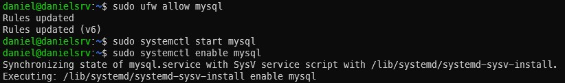
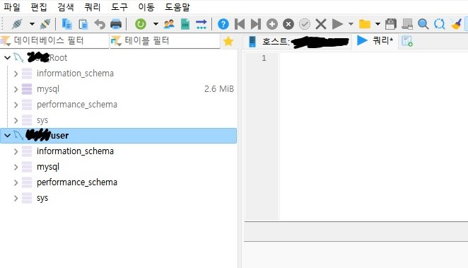

이번 시간에는 우분투 서버에 MySQL을 설치 해 보는 기본 세팅 시간을 가져 볼게요!

## 📖 MySQL 설치와 접속 기본 세팅
본격적인 설치 시작 전, 우분투 서버에 업데이트 내용이 있는지 확인하는 습관을 들여 보아요 :)
~~~bash
sudo apt-get update
sudo apt-get upgrade
~~~

MySQL 설치는 아래의 명령어를 통해 진행합니다.

~~~bash
sudo apt install mysql-server
~~~

그리고 서버 외부에서도 MySQL에 접속 가능하게 하기 위해 방화벽 설정을 진행했습니다.
~~~bash
sudo ufw allow mysql
~~~

서버 재기동 후 MySQL을 시작시키는 명령어는 아래와 같습니다.
~~~bash
sudo systemctl start mysql
~~~

매번 재기동 후 MySQL을 실행시키는 것이 번거롭다면 아래의 명령어를 사용 해 주면 재기동 후 자동으로 MySQL이 실행돼요.
~~~bash
sudo systemctl enable mysql
~~~

문제없이 잘 따라왔다면, 아래와 같은 내용 비슷한 내용이 보일거예요!

## 📖 root 계정 패스워드 바꾸기

우선, root 계정의 패스워드는 보안상 설정을 해 주는 것이 좋겠죠? 
root 권한으로 MySQL 콘솔로 들어와 아래와 같이 쿼리를 작성 해 줍시다.
~~~bash
sudo mysql -u root
alter user 'root'@'localhost' identified by 'password';
flush privileges;
~~~

계속해서 상세 설정을 진행 해 볼게요. 
root 계정을 우분투 밖에서 접속하게 하려면, 
~~~bash
use mysql;
update user set host='%', plugin='mysql_native_password' where user='root';
flush privileges;
~~~

위 쿼리를 동작 시킨 후 텍스트 에디터로 config파일을 수정 해 줍니다.
~~~bash
sudo vi /etc/mysql/mysql.conf.d/mysqld.cnf
~~~

파일을 열고 내용을 아래로 내리다보면 보이는 bind-address 부분을 아래와 같이 수정 해 줍니다.
~~~
#bind-address       = 127.0.0.1     # 기본 설정된 내용
bind-address        = 0.0.0.0      # 모든 IP에서의 접근을 허용
~~~

config 파일을 수정 완료 했다면 MySQL을 재실행 합니다.
~~~bash
sudo systemctl stop mysql
sudo systemctl start mysql
~~~

이제 변경한 root 계정 정보로 접속이 가능한지, 변경된 내용으로 우분투 서버 외부에서도 디비 접속이 잘 되는지 확인하면 돼요!
~~~bash
mysql -u root -p 
~~~

## 📖 새 유저 계정 만들기

마찬가지로 보안상 이유로 root 계정을 그대로 사용하는 것 보다
새로운 사용자 계정을 생성해서 DB를 운영 하는 것이 좋겠죠?

~~~bash
mysql -u root -p # root 계정으로 디비 접속
create user 'new_user'@'%' identified by 'new_user_password';
grant all privileges on *.* to 'new_user'@'%' with grant option;
flush privileges;
~~~

> 💁🏻 팁! privileges on \*.\* 쿼리의 \*.\* 부분을 수정하면 특정 데이터베이스에만 접근 가능하도록 권한을 제한시킬 수 있다. 
ex. targetdb.* = "targetdb"라는 이름을 가진 데이터베이스 하위의 전체 테이블에만 접근 가능한 권한을 가져요

문제없이 잘 완료되었다면, 아래와 같이 root 계정과 사용자 계정 모두 우분투 외부에서도 DB 접속이 가능함을 확인할 수 있어요!

## 💁🏻 결론!
* MySQL 설치 및 기본 세팅 방법에 대해서 정리 했어요.
* root 계정은 보안상 서비스를 운영할 때 사용하는 것을 지양해야 해요.
* 사용자 계정을 생성하고 접근 가능한 데이터베이스를 제한할 수 있어요.

 
직접 아무것도 없는 서버에 디비를 설치하는 과정 자체가 너무 오랜만이었어요. 
그런 의미에서 오늘은 어쩌면 기본중에 기본 내용이라고 할 수 있는 내용만 가볍게 정리 해 보는 시간이었습니다! 

다른 MySQL 설정이나 사용법에 대한 추가 내용이 있다면 또 정리 해 볼게요 🙌

그럼, 다음 글에서 또 뵈어요 :) 🪶