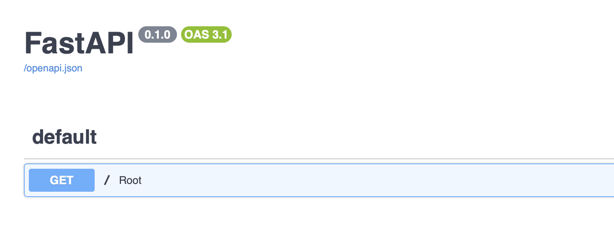

오늘은 우분투 서버에 FastAPI를 설치 해 보고 잘 동작하는지까지 확인 해 볼게요!

## 📖 FastAPI란?
FastAPI는 Python을 기반으로 만들어진 웹 프레임워크입니다.
이전까지 가장 대중적으로 사용되고 있던 파이썬 프레임워크는 Django, Flask였어요.
비교적 가벼운 웹개발이라면 Flask를 사용했고 조금 더 볼륨있는 프로젝트라면 Django를 사용했죠.

이런 와중에 등장한 FastAPI는 아래와 같은 특징 덕에 빠른 호응도를 얻어냈어요.<br/>
👉 "조작법은 단순하면서도 성능적으로는 우수하다"<br/>
👉 API 문서 자동 생성 (Swagger, ReDoc)<br/>
👉 비동기 동작, Pydantic을 사용한 Validation 체크<br/>
👉 뛰어난 공식문서 가이드<br/>

## 📖 FastAPI 설치하기

위에서 정리했다시피, FastAPI는 Python을 기반으로 만들어진 프레임워크이기 때문에, Python이 설치되지 않았다면 먼저 선행해서 설치 해 줘야 해요!

여기서는 Python이 잘 설치되어 있다고 가정하고 설치 해 볼게요.

```bash
pip install fastapi
pip install uvicorn   # 가상화 서버
```

여기서 추가로 설치한 uvicorn이란 친구는 async/await을 기반한 비동기 프로그래밍을 지원하는 ASGI로 실행 결과를 확인하기 위한 용도로 설치해요.

여기까지가 FastAPI 설치 과정이었습니다! 별 거 없었죠?

## 📖 그럼 잘 되는지 테스트 해 보자!

테스트용 폴더를 하나 만들어 주고, 폴더 하위에 main.py 파일을 새로 하나 작성 해 볼게요.

```python
from fastapi import FastAPI

app = FastAPI() # FastAPI 모듈을 할당

@app.get("/")   # get 방식으로 루트 경로가 호출되었다면
async def root():
    return {"message": "hello fastapi"} # message 객체에 hello fastapi 라는 string을 리턴
```

위와 같이 작성 후 잘 저장했다면, 이제 API 서버를 실행시켜서 확인해 볼 차례입니다!
```bash
python3 -m uvicorn main:app --reload
```

명령어는 아래와 같은 구조로 되어있어요.

- univorn: 서버 실행 명령어<br/>
- main: 실행할 초기 파이썬 파일 이름. 만약 실행 소스코드 파일 이름이 `startup.py`였다면 `startup:app`으로 수정<br/>
- app: FastAPI모듈을 할당한 객체명. 만약 `entity=FastAPI()`라고 위에서 실행했었다면 여기서도 `main:entity`라고 기재해줘야 정상 실행한다.<br/>
- reload: 소스코드가 변경되었을 시, 서버를 자동으로 재시작해주는 옵션<br/>

<br/>
이제 로컬 호스트 8000번 포트로 접속 했을 때, 우리가 작성했던 예시 json이 출력 되는 것을 확인할 수 있을 거예요.

추가로 특정 아이피나 특정 포트를 통해서만 접속하고자 한다면 뒤에 host, port 옵션을 주면 돼요.
```bash
# 모든 아이피 접근을 허용하되 포트번호 1234를 통해 들어오는 것만 허용
python3 -m uvicorn main:app --reload --host 0.0.0.0 --port 1234
```

자동으로 생성 해 준다던 API 문서도 확인 해 볼까요?

- $url/docs

- $url/redoc


## 💁🏻 결론!
* FastAPI는 개발자들에게 빠른 호응도를 얻어내고 있는 파이썬 프레임워크이다.
* uvicorn을 사용하여 작성한 파이썬 파일을 API서버화 할 수 있다.
* uvicorn 명령어 뒤 옵션을 사용하여 접속제한을 거는 것이 가능하다.

<br/>
오늘은 간단하게 GET 요청에 대한 작성만으로 잘 작동하는지 확인 해 봤어요.<br/>
다음 시간에는 대표적인 CRUD 메소드인 POST, PUT, PATCH, DELETE 등의 메소드를 추가하여 실제 구성을 어떻게 가져갈 것인지, request payload를 받아 처리하는 법에 대해 정리 해 볼게요!

그럼, 다음 글에서 또 뵈어요 :) 🪶